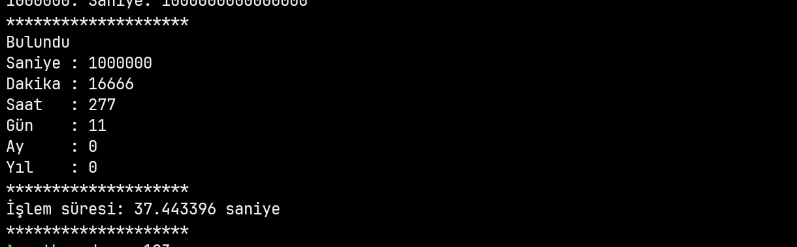

# TUZ TANESİ SAYMA HESAPLAMASI
TikTok üzerinde bir kullanıcı bir tuz tanesinin 10 katrilyon atomdan oluştuğunu, saniyede 1 milyar tane atomu sayan bir bilgisayarın toplam 500 milyon yılda sayabileceğini iddia ediyor.
https://vt.tiktok.com/ZSjEsNcD7/

Bu bilgi yanlıştır. Yapılan matematiksel ve yazılım analiziyle Pythonda bir örnek oluşturulmuştur. Bu örneğe göre saniyede 1 milyar hızla atom sayabilen bilgisayar yaklaşık 11 günde sayma işlemini tamamlayabilir.

